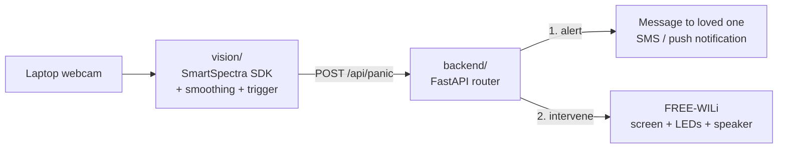

# Aegis

A desktop health companion that detects acute stress from a webcam and physically intervenes with a guided breathing device.

Built at MHacks. Tracks: Hardware, Healthcare, AI.

> **Not a medical device.** Aegis is a prototype. Webcam rPPG is not validated for diagnosing panic, asthma, or cardiac events. The demo scope is **acute stress / panic-style episodes only**. Do not claim asthma or cardiac detection to judges.

---

## 1. How it works



1. **Monitor** — `vision/` reads the webcam through the Presage SmartSpectra SDK and tracks pulse and breathing rate.
2. **Detect** — `vision/` smooths the signal, checks biometric thresholds, and fires `POST /api/panic` when acute stress/panic is detected.
3. **Route** — `backend/` coordinates alerting the user's loved one and sending the intervention command to FREE-WILi.
4. **Intervene** — FREE-WILi wakes, pulses LEDs in a 4-4-4-4 box-breathing cycle, animates a breathing circle, and plays calming guidance.

---

## 2. Repository layout

```text
aegis/
├── README.md
├── .env.example              # Placeholders only. Never commit .env
├── .gitignore                # Must include .env
│
├── firmware/                 # Firmware Engineer — FREE-WILi
│   ├── CMakeLists.txt
│   ├── src/
│   │   ├── main.cpp          # Command listener + state machine
│   │   ├── ui.cpp            # Breathing circle on 3.5" display
│   │   └── leds.cpp          # LED pulse pattern
│   ├── include/aegis.h
│   └── assets/               # Audio clips uploaded to the board
│
├── backend/                  # Backend Engineer — FastAPI
│   ├── requirements.txt
│   ├── main.py               # App, /events, /api/panic, /health
│   ├── device.py             # FREE-WILi adapter (serial or network)
│   ├── comms.py              # Messaging alert
│   └── voice.py              # ElevenLabs clip pre-generation
│
├── vision/                   # Vision Engineer — SmartSpectra
│   ├── package.json
│   ├── monitor.js            # Capture + metrics stream
│   └── utils/
│       ├── smoothing.js      # Filtering
│       └── trigger.js        # Baseline + trigger rule
│
└── mechanical/               # Product Designer
    ├── aegis_stand.stl
    ├── laser_cut.dxf
    └── assembly_notes.md
```

---

## 3. Decisions to lock in the first 2 hours

These are unresolved in the original plan. Each blocks at least one other person. Owner decides; write the answer here.

| # | Question | Default | Owner | Decision |
|---|----------|---------|-------|----------|
| D1 | Vision language | Node.js SmartSpectra SDK. Fallback: C++ SDK example binary printing JSON to stdout. There is no official Python SDK. | Vision | |
| D2 | Laptop → board transport | USB serial via the `freewili` Python package. Use WiFi only if confirmed working on our board. | Firmware + Backend | |
| D3 | Board program type | Confirm with FREE-WILi mentors: custom C++ firmware vs. a WASM app run on stock firmware. Pick the faster path. | Firmware | |
| D4 | Audio path | Pre-generate clips with ElevenLabs, upload to board, play on trigger. Fallback: play on laptop. No live streaming to board. | Backend + Firmware | |
| D5 | Demo OS | Mac or Linux laptop for vision (C++ SDK targets Mac/Linux; Windows needs WSL). | Vision | |
| D6 | "Stress" metric | SmartSpectra exposes pulse, breathing, expression, talking. Confirm whether a stress score exists. If not, trigger on pulse + breathing. | Vision | |

---

## 4. Interface contracts

These are the only things modules share. Change them only with team agreement, and update this file.

### 4.1 Vision → Backend: `POST http://localhost:8000/events`

```json
{
  "event_id": "8b1c2f9e-3a4d-4c1e-9f0a-2d7e5b6c1a90",
  "timestamp": "2026-10-03T21:14:05Z",
  "source": "vision",
  "severity": "high",
  "metrics": {
    "pulse_bpm": 118,
    "breathing_rpm": 26,
    "baseline_pulse_bpm": 74,
    "baseline_breathing_rpm": 14,
    "signal_quality": 0.82
  },
  "reason": "pulse +44 over baseline for 20s; breathing +12"
}
```

- `source`: `"vision"` or `"manual"`.
- `severity`: `"moderate"` or `"high"`.
- Backend returns `202 Accepted` immediately. Vision must not wait on downstream APIs.

### 4.2 Backend → Device (logical commands)

Transport is decided in D2. The payload is the same either way.

```json
{ "cmd": "intervene", "pattern": "box", "phase_ms": 4000, "duration_s": 120, "clip": "calm_01.wav" }
{ "cmd": "idle" }
{ "cmd": "ping" }
```

- Device replies `{"ok": true, "state": "intervening" | "idle"}`.
- `intervene` while already intervening restarts the timer. It must not stack.

### 4.3 Backend endpoints

| Method | Path | Purpose |
|--------|------|---------|
| POST | `/events` | Real trigger from vision |
| POST | `/simulate` | Fires a fake `high` event. **Used in the demo.** |
| POST | `/device/idle` | Stops the intervention |
| GET | `/health` | Status of device link, loved one messaging, ElevenLabs |

---

## 5. Detection logic (vision)

A fixed rule like `HR > 110 AND stress > 80` will misfire on anyone who just climbed stairs. Use a baseline.

1. **Calibrate** — first 60 s: record median pulse and breathing as baseline.
2. **Smooth** — rolling median or moving average over ~10 s. Drop samples with low signal quality.
3. **Gate** — ignore samples when no face is detected or the user is talking.
4. **Trigger** — pulse ≥ baseline + 30 bpm **and** breathing ≥ baseline + 8 rpm, sustained ≥ 15 s.
5. **Cooldown** — no new event for 5 min after a trigger.

Thresholds are starting points. Tune them on the team, then freeze them before judging.

---

## 6. Environment setup

Copy `.env.example` to `.env` and fill in values. **Never commit `.env`. Never paste real keys into docs, prompts, or chat.**

```bash
# .env.example
PRESAGE_API_KEY=
ELEVENLABS_API_KEY=
RELAY_API_KEY=
EMERGENCY_CONTACT_PHONE=+1XXXXXXXXXX
BACKEND_URL=http://localhost:8000
DEVICE_TRANSPORT=serial        # serial | wifi
DEVICE_ADDRESS=                 # IP if wifi; blank for auto-detect serial
```

### Run order

```bash
# 1. Backend
cd backend && pip install -r requirements.txt && uvicorn main:app --port 8000

# 2. Device check
curl -X POST localhost:8000/simulate

# 3. Vision
cd vision && npm install && node monitor.js
```

---

## 7. Roles

### 7.1 Firmware Engineer — `firmware/`

**Goal:** the board reacts to commands within 1 s.

- Resolve D2 and D3 first.
- Implement the command listener for `intervene`, `idle`, `ping` (§4.2).
- Idle state: dim, slow LED glow, "Aegis" on screen.
- Intervene state: breathing circle expands 4 s, holds 4 s, contracts 4 s, holds 4 s. LEDs track the circle.
- Play the clip named in the command.
- Return to idle after `duration_s` or on `idle`.

**Done when:** `curl /simulate` triggers the full sequence 10 times in a row with no reset.

### 7.2 Backend Engineer — `backend/`

**Goal:** one event in, all actions out, with failure isolation.

- Build `/events`, `/simulate`, `/device/idle`, `/health` (§4.3).
- Send the device command first. Run messaging alerts asynchronously with timeouts.
- A failing external API must log an error, not block the device.
- Pre-generate 3–5 ElevenLabs clips at setup, not at trigger time (D4).
- Deduplicate on `event_id`.

**Done when:** `/simulate` triggers device intervention reliably.

### 8.3 Vision Engineer — `vision/`

**Goal:** a stable metrics stream and a trigger with few false positives.

- Resolve D1, D5, D6 first.
- Get raw pulse and breathing on screen.
- Implement §5: calibrate, smooth, gate, trigger, cooldown.
- POST events matching §4.1.
- Show a small live overlay: pulse, breathing, baseline, state. Judges need to see the numbers.

**Done when:** 10 min of calm sitting produces zero triggers.

### 8.4 Product Designer — `mechanical/`

**Goal:** the board looks like a product and the demo tells a clear story.

- Get board dimensions and port locations from Firmware before CAD.
- Enclosure: ~15–25° screen tilt; LEDs, speaker, and USB port unobstructed.
- Leave cable routing for USB to the laptop.
- Write the demo script (§9) and table layout.

**Done when:** board is mounted, cabled, and survives being carried to the judging table.

---

## 9. Demo plan

Nobody on the team can produce a real panic attack on cue. Plan for that.

1. Show the live vision overlay with calm baseline numbers.
2. Explain the trigger rule in one sentence.
3. Fire the event. Options, in order of reliability:
   - `/simulate` via a hotkey or button.
   - A teammate does jumping jacks off-camera, then sits (real elevated pulse; less reliable).
4. Device wakes, breathes, speaks. Phone receives SMS. Show the FHIR record.
5. Be explicit with judges about which step was simulated.

---

## 10. Integration milestones

| By hour | Milestone |
|---------|-----------|
| 2 | Decisions D1–D6 filled in. Contracts frozen. |
| 6 | `/simulate` → device changes state (no UI polish). |
| 10 | Vision streams real metrics to console. |
| 14 | Vision → backend → device, end to end. |
| 18 | Messaging alert + audio wired in. |
| 22 | Enclosure assembled. Thresholds frozen. |
| 24+ | Demo rehearsal only. No new features. |

---

## 11. Known limitations

- rPPG degrades with motion, poor lighting, dark rooms, and off-axis faces.
- Elevated pulse is not specific to panic. Exercise, caffeine, and excitement look the same.
- The system only works while the user sits in front of the laptop.
- SMS alerts to real contacts based on unvalidated signals carry real-world risk. Demo with a teammate's phone.
